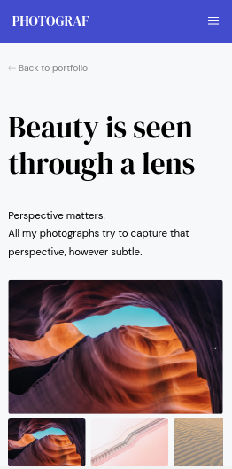
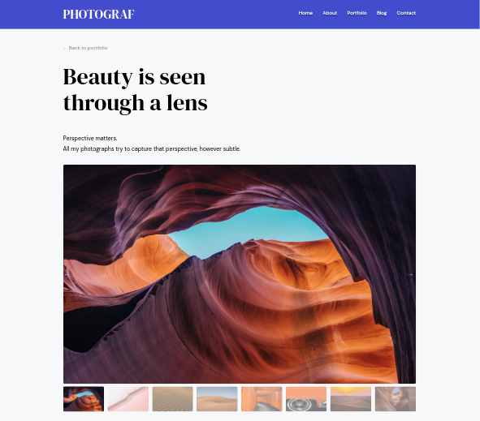

# Photograph Gallery

  <h2>
    <a href="https://j-emilien-photograf.netlify.app/">
      Live demo
    </a>
  </h2>

## Overview

### On mobile view

### On desktop view

Set up...

## Dependencies

- Node.js
- Figma
- Figma Font Helper

## Install

Install `node-sass` for the Sass compilation by doing:

1. `npm i`

## Getting started

### Design

Find the design here:

- online at [figma.com/Laaqiq-1-Portfolio-detail-Responsive](https://www.figma.com/file/VgF87mULloYb7HZ1EMCRzU/Laaqiq-1-Portfolio-detail-Responsive?node-id=0%3A1) (Recommended)
- by importing the `.fig` file in [the `source_materials` folder](./source_materials/) into your figma app.

### Webroot

For a structure reason, it's a good idea to isolate all the web-files in the `webroot` folder.
Something like images, fonts, HTML, JS, and CSS.

3. Create a `webroot/index.html` file.

### Sass

It is better to use an `scss` folder for all the Sass files.

4. Create a `scss/index.scss` file, that will act as the manifest Sass file.
5. Build a CSS file once by running the `npm run scss` script.

All the Sass files will be output to the `webroot/css` folder.

### Linking up styles

6. Link up the new `webroot/css/index.css` stylesheet in the `index.html`

## Development

Run the `scss:watch` task when developing this project.

## Marking & requirements

- **All the HTML**
  - The HTML should be clean, accurate, and consistent.
  - Use the right elements for the right job.
  - Structure the used HTML nicely.
  - Make sure the used HTML is accessible.
  - Make sure the used HTML is valid.
  
- **As much Sass as possible**
  - Sass should use variables at a minimum, and be extended with mixins, functions, and abstract classes if possible.
  - Sass output should be orderly, and expected.
  - Keep SCSS files clean
  - Add helpful comments to the difficult-to-understand parts.

- **CSS**
  - Add style to elements that the user can focus, hover over, or interact with.
  - The work should be Mobile-First by default, and Responsive.

- **Images**
  - Using a CSS `background-image` or an `` in the HTML? Make sure it's for the right reasons.
  - Use the correct image format for each case
 
- **Fonts**
  - Use a `fonts.google.com`-supplied stylesheet for the fonts, but better use `@font-face` declarations. Link up the WOFF2 and WOFF formats to CSS using as many `@font-face` at-rules as needed.
  - Use `local()` functions for locally-installed fonts.
  - Test that website works without local font support.
